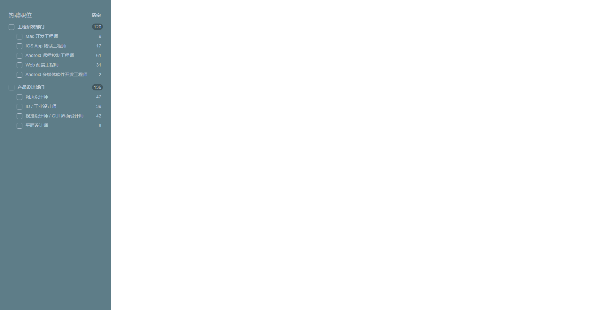

### 运行
```
npm install
npm start
```

### 完成度说明
本来想抽象出一个通用组件，做成递归树，但中途被stuck进行不下去了，大概是对递归树理解不到位和对React还不太熟悉，这部分half-done的代码在recursive分支。

最终完成了一个简化版，只支持二级树，但对题目中的场景是满足了。

### 项目记录
#### 第一天

12:14-12:22 审题

12:22--15:20 完成项目创建和例子练习

- tutorial game demo
- devtool
- .editorconfig
- Immutability: Easier Undo/Redo and Time Travel(switch) / Tracking Changes / Determining When to Re-render in React(shouldComponentUpdate())
- Keys (later


15:20--19:00 学习
- thinking-in-react
- idiomaticReact跑不起来
- 学习git commit规范和练习，https://ivweb.io/topic/58abda9d2117ae2f4995b4a8

20:00--21:00 定义数据结构和组件拆分，参考elementUI tree组件

21:00-24:00 coding


#### 第二天

10:00--12:00
- props: list
- state: checkbox状态
- 把checkState和data分开，没法进行

13:00--13:30 开始重写，简化需求

18:00--21:30 完成

